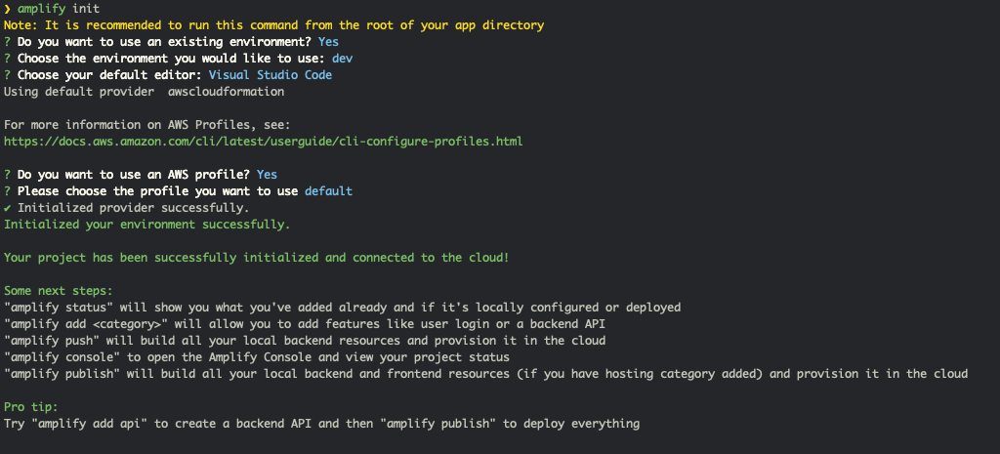

## Billing Project

The project use amplify to create stack. To use this projet you need aws account see [Create AWS Account](https://portal.aws.amazon.com/billing/signup?redirect_url=https%3A%2F%2Faws.amazon.com%2Fregistration-confirmation#/start)

For more information bout amplify you need to follow the [documentation](https://docs.amplify.aws/).

The frontend side is create with [Create React App](https://github.com/facebook/create-react-app).

## To start project

You need to git clone the projet. And in the root folder launch the command

`amplify init`

You see this message in your console.

or use

`amplify pull`

to get the backend side

You could deploy direclty on push your git branch.

## GraphQL API

To test graphql api you need to go at console appSync with this command

`amplify api console` and select > Graphql

## Available Scripts

In the project directory, you can run:

### `yarn start`

Runs the app in the development mode. 
Open [http://localhost:3000](http://localhost:3000) to view it in the browser.

The page will reload if you make edits. 
You will also see any lint errors in the console.

### `yarn test`

Launches the test runner in the interactive watch mode. 
See the section about [running tests](https://facebook.github.io/create-react-app/docs/running-tests) for more information.

### `yarn build`

Builds the app for production to the `build` folder. 
It correctly bundles React in production mode and optimizes the build for the best performance.

The build is minified and the filenames include the hashes. 
Your app is ready to be deployed!

See the section about [deployment](https://facebook.github.io/create-react-app/docs/deployment) for more information.
